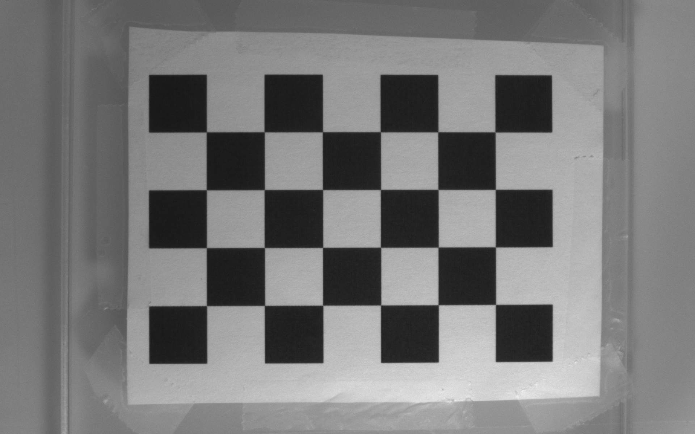
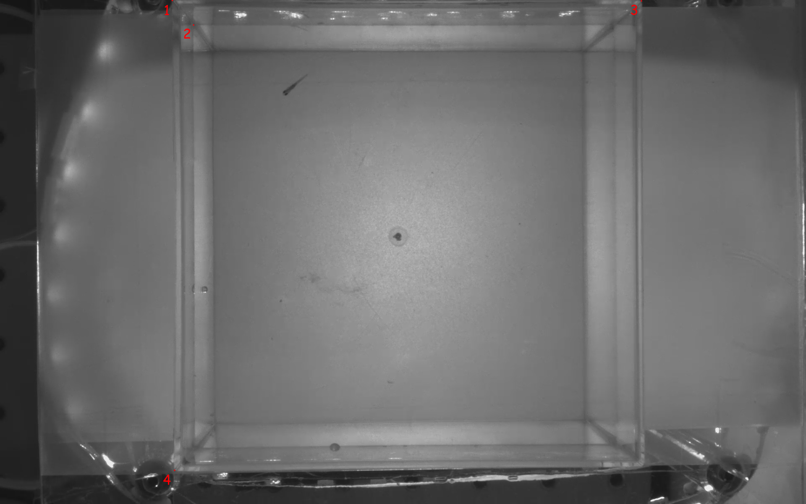

# Calibrating parameters for two-camera triangulation
## Workflow
### Set up chessboard
Follow the instructions from [Calibration Checkerboard Collection](https://markhedleyjones.com/projects/calibration-checkerboard-collection). Download and print a chessboard and mount on a flat surface. Take note of the individual square size in mm and the **inner** width and height. E.g., the chessboard below has an **inner** width of 6 and an **inner** height of 4.
### Capture chessboard image pairs
Use [capture_calibration_pairs_v3.py](/capture_calibration_pairs_v3.py) with `SAVE_MODE` set to `True` to capture a good amount of calibration images. These will be saved in a new folder with the current timestamp.
- Images should be taken from many different angles and distances, but ensure: 1. Entire chessboard is visible in each image, 2. Always orient based on your chosen width and height
- Take a couple images with the chessboard laying **flat** on the surface that the enclosure will eventually be laid on (i.e., we are assuming that this surface is parallel to the water surface)
- Ensure bright and consistent lighting (i.e., if using IR filter, either shine IR light on chessboard or take off filter)



### Run calibration toolbox
Run [calibration_toolbox_v2.py](/calibration_toolbox_v2.py) to save important camera parameters. **IMPORTANT:** change `pts_w`, `pts_h`, and `square_size_mm` in `CalibrationToolbox` constructor to match chessboard details.
- Note: matrix parameter file names are hardcoded and should not be changed as they are referenced in other codes.
- `ct.calibrate_camera()`: Run once per camera to get intrinsic parameters (matrix, distortion, etc). Saved as `cam-i.npz`
- `ct.calibrate_stereo()`: Run for the camera pair to get relational parameters (trans, rot) relative to the first camera. Saved as `stereo_matrices.npz`
- `ct.get_projection_matrices()`: Run for the camera pair to get projection matrices for each camera. Necessary for `cv2.triangulatePoints()`. Saved as `projection_matrices.npz`

### Get important image points
Use [find_origin.py](/find_origin.py) and change `POINTS_TO_GET` in `main` to loop that many times. You must have a valid pair of **recorded videos** (for the image displayed) and a valid calibration directory with the calibration files already saved.
The (4) points that you must need for ray correction are:
1. A point at water level.
2. An origin point on the enclosure
    - This **should** be the cloest top left enclosure point (as is the common coordinate convention)
3. A point on the desired x axis of the system (**should** be the closest top right enclosure point)
4. A point on the desired y axis of the system (**should** be the closest bottom left enclosure point)



The program will display each pair of points consecutively. Accordingly, choose each pair consecutively. Use mouse for rough adjustments, and arrow keys for fine adjustments.

It will print each **triangulated point** in the terminal, so **copy and save them** somewhere.

### Set up ray correction parameters
For the first time at least, we need to set up the ray correction parameters using the 4 points as above.
- Run `setup_rc()` by itself.
- **IMPORTANT:** paste those 4 points into the 4 fields in the function, and also change the chessboard parameters in `rc.get_pnp()`. For example:
    ```python
    water_point = np.array([-47.167812398340914, 52.11593132229903, 445.0398179347797])
    box_origin_point = np.array([-49.638713274534176, -45.97083631512408, 430.57195239144664])
    box_xaxis_point = np.array([50.416291444974846, -46.48186324869854, 435.3122079279627])
    box_yaxis_point = np.array([-48.621162654825525, 54.19308586553376, 429.52718188283563])
    # Skip
    rc.get_pnp(chessboard_path, 6, 4, 10)
    ```
- Note: The chessboard in the image should be **flat** on the table and taken by the **primary** camera.
- Ray calibration parameters should now be saved as `ray_parameters.npz`.
### Running ray correction
Assuming we now have all required calibration data (`stereo_matrices.npz`, `ray_parameters.npz`):
- Construct the `RefractionCalibration` object with `upload=True`.
- Use `rc.correct_underwater_point()` to get the corrected 3D position given two raw 2D pixel locations.
    - This takes in two length-2 numpy arrays and outputs one length-3 numpy array.
    - Points are internally undistorted inside the function.
- Use `rc.transform_point` to transform camera coordinates to enclosure coordinates.
- Example usage:
    ```python
    water_1_points = np.array([(986.0, 614.0), (1088.0, 586.0)])
    water_2_points = np.array([(938.0, 900.0), (1036.0, 892.0)])
    water_3_points = np.array([(997.0, 372.0), (1102.0, 328.0)])
    water_4_points = np.array([(681.0, 705.0), (767.0, 683.0)])
    water_5_points = np.array([(1160.0, 895.0), (1273.0, 890.0)])

    for p in [water_1_points,
            water_2_points,
            water_3_points,
            water_4_points,
            water_5_points]:
        underwater_point = rc.correct_underwater_point(p[0], p[1])
        if underwater_point is not None:
            underwater_point = rc.transform_point(underwater_point)
            print(f"Underwater Point: {underwater_point}")
    ```