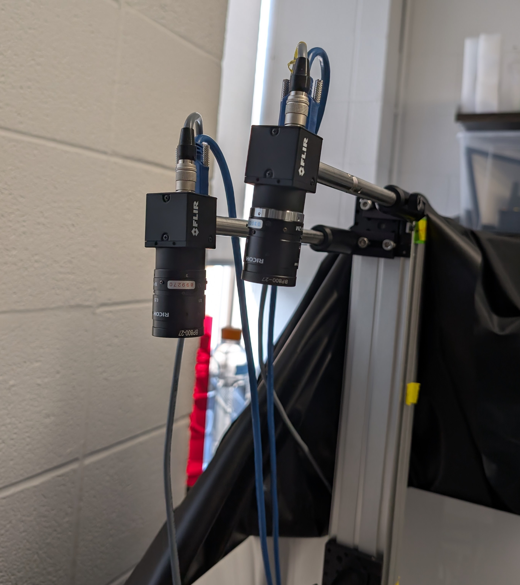

# Setting up cameras for two-camera triangulation
## Hardware
### Pre-testing
Before anything, make sure the two cameras can simultaneously be recognized by the host device.
1. Connect each camera's corresponding cable (USB3/GigE/etc.). Both cameras should be blinking green.
2. Open the Teledyne SpinView application and ensure both video feeds are working.
3. At this point, make note of which camera you want to use as the **primary camera** and keep its **serial number**.
#### Troubleshooting & Considerations
- Try to reset the cameras to default settings if video feeds are not working.
- Either connect cables directly to host computer or use a USB hub with USB3 support.
### Connecting the master-slave setup
Refer to the resources in the description section in [README.md](/README.md).
1. In the Teledyne guide (the first link) scroll down to the section with your corresponding camera.
2. Connect the jumper cables to the breadboard in the configuration specified above.
3. Connect the GPIO cable labeled *primary* to the primary camera as chosen above.
#### Troubleshooting & Considerations
- Ensure all jumper cables are connected correctly and none are loose.
## Software
### Environment setup
- Create the conda environment from [environment.yml](/environment.yml):
    ```bash
    conda env create -f environment.yml
    ```
    (or create a uv/venv manually). More details in [conda docs](https://docs.conda.io/projects/conda/en/latest/user-guide/tasks/manage-environments.html#creating-an-environment-from-an-environment-yml-file).
- Activate the new environment by `cd`'ing to the directory, then:
    ```bash
    conda activate fishcodes
    ```
- Download the latest Spinnaker SDK Python wheel as outlined in [README.md](/README.md).
Manually install the wheel according to its location, for example:
    ```bash
    pip install spinnaker_python-4.2.0.83-cp310-cp310-win_amd64.whl
    ```

### Software Pre-testing
Run [capture_calibration_pairs_v3.py](/capture_calibration_pairs_v3.py) with the `SAVE_MODE` constant set to `False`.
- If both videos are clear and lag-free, it works!
- If the feed lags or a significant number of frames are dropped, increase the value of `DISPLAY_EVERY_N_FRAMES`.
#### General software troubleshooting & considerations
- You **must** change the `SERIAL_PRIMARY` class constant in [camera_driver_v2.py](/camera_driver_v2.py). For example:
    ```python
    SERIAL_PRIMARY = "24048471"
    ```
- The default constructor for `CameraDriver` is
    ```python
    def __init__(self,
                frame_rate: float = 100,
                exposure_time: float = 5000)
    ```
- To change these parameters, either change them directly in the class definition in [camera_driver_v2.py](/camera_driver_v2.py), or in a specific `CameraDriver` constructor; e.g.,
    ```python
    ct = CameraDriver(frame_rate=150, exposure_time=2000)
    ```
- Note that frame rate is **limited** by exposure time, so don't set it too high. E.g., if exposure time is 10000 μs, then 1/(0.01 s) = 100 fps = max possible frame rate.
### Mounting the cameras
Once we confirm that the syncing setup works, we can mount the cameras in a stereo configuration. It is **highly** recommended to point both cameras toward a open-top enclosure filled with water (1. to maintain the air-water interface, 2. to avoid training two separate object recognition models). An example:



Note: Cameras are separated by a few cm and a slight angle. Despite this, they can both see the entire enclosure perfectly.

### Adjusting camera hardware
Ensure the **entire** enclosure is visible in both cameras. If not, move cameras farther away.

If using fixed focus lenses:
1. Adjust aperture low *enough* to balance FOV with brightness
2. Adjust focus to *middle* of enclosure for best FOV (e.g., if using a 10 cm enclosure, adjust focus to the 5 cm mark).